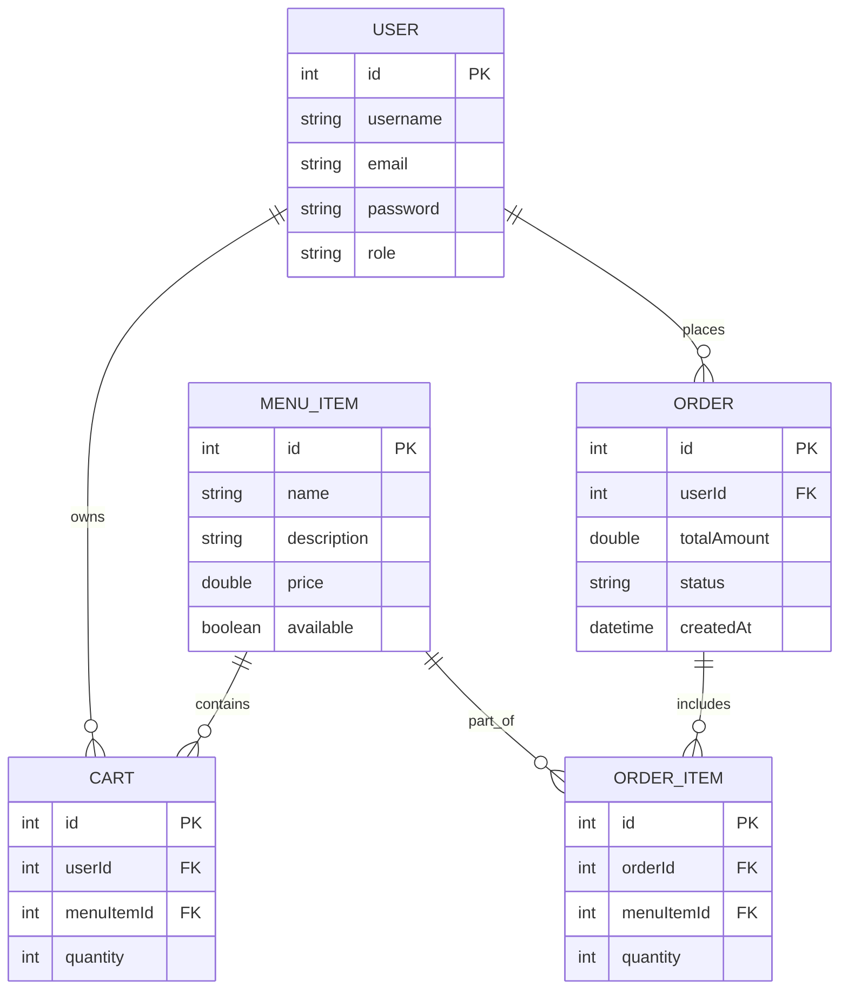

# 🍴 Restaurant Management System

A **Spring Boot + Java** backend application for managing **restaurants, menus, and customer orders**.
This project demonstrates **clean architecture**, **RESTful API design**, and **modern development practices** with production-ready tooling.

---

## 🚀 Features

* 👤 **User Management** – Register, authenticate, and manage users
* 📋 **Menu Management** – Add, update, delete, and fetch menu items
* 🛒 **Cart System** – Add/remove items, update quantities
* 🛍️ **Order Management** – Place, update, and track orders
* 📖 **Swagger API Docs** – Interactive documentation with Swagger UI
* ⚡ **Validation & Error Handling** – Standardized error responses
* 🗄️ **Database Integration** – Relational database with JPA/Hibernate
* 🏗️ **Scalable Architecture** – Layered design (Controller → Service → Repository)

---

## 🛠️ Tech Stack

* **Backend**: Java 17+, Spring Boot
* **Database**: MySQL (configurable)
* **API Docs**: Swagger (Springdoc OpenAPI)
* **Build Tool**: Maven
* **Testing**: JUnit + Mockito
* **Version Control**: Git & GitHub

---

## 📂 Project Structure

```
Restaurant/
 ┣ src/
 ┃ ┣ main/java/com/restaurant/
 ┃ ┃ ┣ controller/   # REST controllers (API layer)
 ┃ ┃ ┣ service/      # Business logic
 ┃ ┃ ┣ repository/   # Data access layer
 ┃ ┃ ┗ model/        # Entities & DTOs
 ┃ ┗ main/resources/
 ┃   ┣ application.properties  # Config (DB, Swagger, etc.)
 ┃   ┗ static/ & templates/   # (if any UI components)
 ┣ test/                       # Unit and integration tests
 ┣ pom.xml                     # Maven dependencies
 ┗ README.md
```

---

## 🏛️ System Architecture

```
flowchart TD
    User[User / Client] -->|HTTP Request| Controller[REST Controller]
    Controller --> Service[Service Layer]
    Service --> Repository[Repository Layer]
    Repository --> Database[(MySQL Database)]
    Service -->|Business Logic| External[External Services (Future: Payments, Notifications)]
    Controller -->|Swagger Docs| SwaggerUI[Swagger UI]
```

---

## 🗄️ Database ER Diagram



---

## ⚡ Getting Started

### Prerequisites

* Install **Java 17+**
* Install **Maven 3.8+**
* Install & run **MySQL** (or configure another DB)

### Clone the Repository

```bash
git clone https://github.com/akarshj08/Restaurant.git
cd Restaurant
```

### Configure Database

Update `application.properties`:

```properties
spring.datasource.url=jdbc:mysql://localhost:3306/restaurant
spring.datasource.username=root
spring.datasource.password=yourpassword
spring.jpa.hibernate.ddl-auto=update
```

### Build & Run

```bash
mvn clean install
mvn spring-boot:run
```

➡️ Server runs at: **[http://localhost:8080](http://localhost:8080)**

---

## 📖 API Documentation

* Swagger UI: 👉 **[http://localhost:8080/swagger-ui.html](http://localhost:8080/swagger-ui.html)**
* OpenAPI JSON: 👉 **[http://localhost:8080/v3/api-docs](http://localhost:8080/v3/api-docs)**

---

## 📌 Example API Usage

### 1️⃣ User Registration

```http
POST /api/users/register
{
  "username": "john_doe",
  "email": "john@example.com",
  "password": "securePass123"
}
```

### 2️⃣ Add Menu Item

```http
POST /api/menu
{
  "name": "Margherita Pizza",
  "description": "Classic pizza with fresh mozzarella and basil",
  "price": 350,
  "available": true
}
```

### 3️⃣ Place Order

```http
POST /api/orders
{
  "userId": 1,
  "items": [
    { "menuItemId": 101, "quantity": 2 },
    { "menuItemId": 102, "quantity": 1 }
  ],
  "paymentMethod": "CASH_ON_DELIVERY"
}
```

---

## 🧪 Running Tests

```bash
mvn test
```

---

## 🛠️ Future Enhancements

* 🔐 Role-based access (Admin, Customer)
* 💳 Payment gateway integration
* 📩 Email/Notification service
* 🐳 Docker & Kubernetes deployment
* ⚙️ CI/CD with GitHub Actions

---

## 🤝 Contributing

1. Fork the repo
2. Create a feature branch → `git checkout -b feature-name`
3. Commit changes → `git commit -m "Add feature"`
4. Push branch → `git push origin feature-name`
5. Open a Pull Request 🚀

---

💡 Built with ❤️ by **Akarsh Jain** using **Spring Boot + Java**
